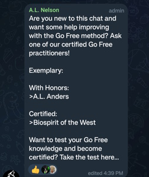
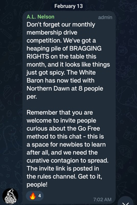

# Greetings Westernkind
This website seeks to expose Jason Köhne (aka NoWhiteGuilt) and his clique. The NoWhiteGuilt network is vast and strange. All well-adjusted persons should be able to see the evidence and conclude that NoWhiteGuilt and his followers are bad actors.    

These very well-done articles by Daily Rake do well to discredit Jason Köhne already. [1](https://dailyrake.ca/2021/12/08/white-while-peeing-part-1-the-overview/), [2](https://dailyrake.ca/2021/12/09/white-while-peeing-part-2-the-intro-in-depth/), [3](https://dailyrake.ca/2021/12/11/white-while-peeing-part-3-pf-meltdown/), [4](https://dailyrake.ca/2021/12/12/white-while-peeing-part-4-go-pee-pillows/), [5](https://dailyrake.ca/2021/12/13/white-while-peeing-part-5-go-pee/), [6](https://dailyrake.ca/2021/12/14/white-while-peeing-part-6-the-poem/), [7](https://dailyrake.ca/2021/12/16/white-while-peeing-part-7-the-business-cards/), [8](https://dailyrake.ca/2021/12/17/white-while-peeing-part-8-dont-talk-about-puppies/), [9](https://dailyrake.ca/2021/12/21/white-while-peeing-part-9-the-creepster/), [10](https://dailyrake.ca/2021/12/22/white-while-peeing-part-10-pissing-off-mark-collett/), [11](https://dailyrake.ca/2021/12/23/white-while-peeing-part-11-milk-the-youtube-lolcow/), Bonus [1](https://dailyrake.ca/2022/01/15/dr-shekelstein-humiliates-the-white-race-by-saturating-them-with-white-guilt-in-online-text-adventure/), [2](https://dailyrake.ca/2022/03/09/white-while-peeing-tranny-finds-jew-westman-and-converts-with-go-pee-story/).    

A few things about Jason Köhne and the NWG community:

*   NWG does not name the Jew.
*   NWG does not advocate political action.
*   NWG accepts transsexuals.
*   Jason Köhne brings his pet tranny to WN events.
*   Jason Köhne has advocated for the [doxing of PF members](https://dailyrake.ca/2021/12/11/white-while-peeing-part-3-pf-meltdown/).
*   Jason Köhne believes white nationalists are ["garbage human beings" and "the lowest form of life"](https://odysee.com/@Commander_Rockwell:b/Jason-Kuhne-piece-of-shit:9).

These are not things pro-White people do.  

### Jason Köhne and His The Clique

Jason Köhne (NoWhiteGuilt) is primarily a [https://www.youtube.com/c/NoWhiteGuilt/videos](YouTube channel) personality. His pro-white YouTube channel was started in 2014 and has suspiciously been able to survive YouTube's aggressive purging of pro-white content this entire time.

His YouTube channel has 24k subscribers. That is a relatively small channel. For context: The biggest channels have tens of millions of subscribers. [This guy](https://www.youtube.com/@StezStixFix) who fixes electronics has 100k subs. [This lady](https://www.youtube.com/@VBirchwood) who likes historical fashion has 70k subs. Most of his videos have 1-3k views. Something to keep in mind as we go further. How many people are really into this stuff?

Jason Köhne was born, raised, and still lives in the D.C. area. It has been confirmed that Jason Köhne [worked as a correctional officer](https://odysee.com/@SouthernDingo:7/officernwg:b) in Virginia from about 2006 to at least 2021. Its unknown if he still works in this capacity. He doesn't seem to be extraordinarily wealthy.

This is a picture of at least some of the NWG inner circle. They are known to attend WN events to promote their way of thinking.

The first thing normal people will notice about Jason Köhne and his followers is the strange lexicon. The term "Antiwhite" itself is common enough and not specific to NWG, but the words "AntiWhiteism", "Westernkind", "Westfolk", “Westmen”, "White Well-Being", "Go-Free", and “Meme-Pathogen” are. These words identify when you're dealing with an NWG entity. The proliferation of strange MK-Ultra words is a tactic used by nefarious government organizations - think grassy "knoll". Nobody talks like this. It's weird and it makes you look weird to other people.

### The Sites

This guy has a lot going on. Let’s go through the sites associated with Jason Köhne and the NWG network:

*   [https://www.youtube.com/c/NoWhiteGuilt/videos](https://www.youtube.com/c/NoWhiteGuilt/videos): Jason Köhne's YouTube channel.
*   [Nowhiteguilt.org](http://Nowhiteguilt.org): His main page. [/links](https://www.nowhiteguilt.org/links/) for all his social media and more.
*   [Nowhiteguiltcollectibles.com](http://nowhiteguiltcollectibles.com): His merch store.
*   [Westernkindgames.com](http://Westernkindgames.com): A very creepy conversation simulator to hone your "Go Free" skills.
*   [Westernkind.com](http://westernkind.com): A website obviously associated with NWG that links to his merch store.
*   [Buygofree.com](http://Buygofree.com): goes to his book listing on Amazon.
*   Theafterparty.tv: was a domain owned by Jason. It tries to download malware now, but it was a podcast Jason did with someone named Jared George (he's important). Episodes can be listened to [here](https://www.spreaker.com/user/nowhiteguilt).
*   [nowhiteguilt.quora.com](http://nowhiteguilt.quora.com): "White Well-Being" advocates gathered here to shill their worldview on Quora.

### Jared George and The White People's Press

Jared George did The After Party podcast with Jason. He has a [YouTube channel](https://www.youtube.com/channel/UCQecLi2rXNQDj2QcZjsuK1g) and a [site for his music](http://thegreatorder.com) - both harmless. NWG comments on his videos. They're obviously very good friends. Jared George is also very involved at [White People Press](http://whitepeoplepress.com). The book “Folk” was essentially his project, he is credited as the sole producer and of the ten authors in the book, three, Jason Köhne, Jared George, and Lovely Porridge, are in the NWG inner circle. In the White People Quarterly Vol. 1 No. 4 the first article in the magazine is an article by Jared about a video contest he hosted with Lovely Porridge at [lastmessagetothewest.com](http://lastmessagetothewest.com). Jason Köhne submitted an entry in the contest. Jared George also contributed a poem in the same issue. Jason Köhne likes poetry. He reads it on [his channel](https://www.youtube.com/playlist?list=PLUWNvBwlnr7loj_eApsHFRHDKPFhAAAD3) and there’s quite a lot of it in the White People Quarterly.  

The White People Press focuses on non-political content, which isn’t inherently bad, but it is notable that it matches NWG's dismissal of political action. Not much is known about the editor in chief Tony Vermont other than the fact that his only public appearance was on NWG’s [podcast](https://www.spreaker.com/user/nowhiteguilt/tap-after-hours-no-white-guilt-the-great_1). It seems very apparent that NWG and his circle have an enormous amount of influence at The White People Press if they don’t outright control it. 

### School of the West

[Schoolofthewest.world](http://Schoolofthewest.world) is an "an educational resource for homeschooling parents".  

  

There it is… "Westernkind". Scroll down and you'll see "White Well-Being" alongside Language Arts and Mathematics. Upon exploring the content you'll find hundreds of lessons, usually text accompanied by a video. Here is Jason [working on his car](https://www.schoolofthewest.world/ss-vehicles/), as part of a lesson in self-sufficiency. The videos are hosted on Odysee. We look at the [Odysee page](https://odysee.com/@School_of_the_West:b) to see: 

567 Uploads! Wow! In [one of these videos](https://odysee.com/@School_of_the_West:b/Onpage-Introduction:7) Brant explains to us that this is his site and that all the content on the site was made by a team of volunteers. Take [this random anatomy video](https://odysee.com/@School_of_the_West:b/Skin-and-hair:f). It’s well done and at the end gives the kids a positive message about being "Westernkind". Am I expected to believe that Jason Köhne's YouTube channel that gets 1-3k views a video and his braindead philosophy inspired all these people to make video courses about everything from Trigonometry to History to Python Programming? 567 quality educational videos is a monumental task. And all seemingly made exclusively for this School of the West. The majority of which have fewer than 10 views. Not Believable!

### The Telegram

These are exclusive screenshots from the "Prometheum Open Chat" on Telegram, the main gathering place for NWG enthusiasts. It has about 80 members. 

They offer regular training in the "Go-Free Method” 

 

Once you complete training, you're “Certified”

Here is them assigning homework.

There are ongoing membership drives monthly.

Here is a [written exam worksheet](Written-GFP-Exam.pdf).

Here is the [list of “Advanced Lexicon”](Advanced-Lexicon.pdf). 

Normal people don’t act like this.

### The Book

To explain the behavior that we find in the telegram chats we need only turn to Köhne’s book “[Go Free: A Guide to Aligning with the Archetype of Westernkind](http://Buygofree.com)”. Jason’s book reads how you would imagine a Scientology handbook on how to remove your hidden Thetans would. An apt analogy because you merely need to replace the concept of Thetan with “meme-pathogen” and that’s pretty much it. We read “I have developed the Archetype Alignment Protocol (AAP) —the process you will use to align yourself with the archetype of Westernkind —the process you will use to Go Free. Going Free is the only path to purifying yourself of the deep-seated toxic beliefs undermining your life. By way of this work, you will come to understand the disease inflicted upon us, a disease I call white-noir. You will be given the tools to cure yourself by identifying, treating, and immunizing yourself against meme-pathogens (MPs) that cause white-noir. As you Go Free, you will awaken the ancient and suppressed potential of Westernkind within you. You will thereby increase your potential-to-power (PTP).” Yep, standard cult stuff. Like some other cults too, there are “degrees” (levels) to achieve, and, needless to say, the vocabulary goes off the rails.

### Conclusion

What is Jason Köhne and his cohort’s motive? At best, it’s simply a cult centered around Jason Köhne and his unappealing philosophy. Another possibility is that this is a well-funded operation to off-ramp and contain potential white nationalists whom would otherwise find a home in groups that engage politically with the system. His persistence and seeming abundance of resources, influence, and manpower, when he should have very little, has me leaning toward the latter. However, it doesn’t seem to have taken off as well as they hoped. Whatever it is, its fucking weird, its well-funded, and dangerous.

*   NWG does not care about white people.
*   NWG is not harmless.
*   NWG is a cult leader and a threat.

All true pro-white advocates need to stay far away from NWG and his clique. Projects that have associated with NWG should be viewed with extreme skepticism. As always, protect yourself and your information, especially around NWG.

              

Contact this site with more information or corrections: nowhiteguiltexposed@protonmail.com
