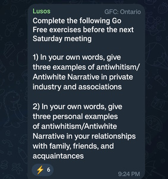

This website seeks to expose Jason Köhne (aka NoWhiteGuilt) and his clique. The NoWhiteGuilt network is vast and strange. All well-adjusted persons should be able to see the evidence and conclude that NoWhiteGuilt and his followers are to be avioded and shunned. 

These very well-done articles by Daily Rake do well to discredit Jason Köhne already. [1](https://dailyrake.ca/2021/12/08/white-while-peeing-part-1-the-overview/), [2](https://dailyrake.ca/2021/12/09/white-while-peeing-part-2-the-intro-in-depth/), [3](https://dailyrake.ca/2021/12/11/white-while-peeing-part-3-pf-meltdown/), [4](https://dailyrake.ca/2021/12/12/white-while-peeing-part-4-go-pee-pillows/), [5](https://dailyrake.ca/2021/12/13/white-while-peeing-part-5-go-pee/), [6](https://dailyrake.ca/2021/12/14/white-while-peeing-part-6-the-poem/), [7](https://dailyrake.ca/2021/12/16/white-while-peeing-part-7-the-business-cards/), [8](https://dailyrake.ca/2021/12/17/white-while-peeing-part-8-dont-talk-about-puppies/), [9](https://dailyrake.ca/2021/12/21/white-while-peeing-part-9-the-creepster/), [10](https://dailyrake.ca/2021/12/22/white-while-peeing-part-10-pissing-off-mark-collett/), [11](https://dailyrake.ca/2021/12/23/white-while-peeing-part-11-milk-the-youtube-lolcow/), Bonus [1](https://dailyrake.ca/2022/01/15/dr-shekelstein-humiliates-the-white-race-by-saturating-them-with-white-guilt-in-online-text-adventure/), [2](https://dailyrake.ca/2022/03/09/white-while-peeing-tranny-finds-jew-westman-and-converts-with-go-pee-story/).    

A few things about Jason Köhne and the NWG community:

*   NWG does not name the Jew.
*   NWG does not advocate political action.
*   NWG accepts transsexuals.
*   Jason Köhne brings his pet tranny to WN events.
*   Jason Köhne has advocated for the [doxing of PF members](https://dailyrake.ca/2021/12/11/white-while-peeing-part-3-pf-meltdown/).
*   Jason Köhne believes White nationalists are ["garbage human beings" and "the lowest form of life"](https://odysee.com/@Commander_Rockwell:b/Jason-Kuhne-piece-of-shit:9).

These are not things pro-White people do.  

### Jason Köhne and His Followers

Jason Köhne (NoWhiteGuilt) is primarily a [YouTube channel](https://www.youtube.com/c/NoWhiteGuilt/videos) personality. His 'pro-White' YouTube channel was started in 2014 and has suspiciously been able to survive YouTube's aggressive purging of pro-White content this entire time.

His YouTube channel has 25k subscribers. That's a relatively small channel. For context: the biggest channels have tens of millions of subscribers. [This guy](https://www.youtube.com/@StezStixFix) who fixes electronics has 100k subs. [This lady](https://www.youtube.com/@VBirchwood) who likes historical fashion has 70k subs. Most of his videos have 1-3k views.

Jason Köhne was born, raised, and still lives in the D.C. area. It has been confirmed that Jason Köhne [worked as a correctional officer](https://odysee.com/@SouthernDingo:7/officernwg:b) in Virginia from about 2006 to at least 2021. Its unknown if he still works in this capacity. He doesn't seem to be extraordinarily wealthy.

This is a picture of at least some of the NWG inner circle. They are known to attend WN events to promote their way of thinking. 

The first thing normal people will notice about Jason Köhne and his followers is the strange lexicon. The term "Antiwhite" itself is common enough and not specific to NWG, but the words "AntiWhiteism", "Westernkind", "Westfolk", “Westmen”, "White Well-Being", "Go-Free", “Meme-Pathogen” and [these others](/Advanced-Lexicon.pdf) are. These words identify when you're dealing with an NWG entity. Having five additional made-up words for the concept of 'White people' is not helping. The creation of unnecessary jargon seems only to have the possibly intentional purpose of insulating the group from outsiders. Its weird and it makes NWG followers look weird to other people because it seems like they are making up words (which they are).

### The Sites

The following are sites associated with Jason Köhne and the NWG:

*   [https://www.youtube.com/c/NoWhiteGuilt/videos](https://www.youtube.com/c/NoWhiteGuilt/videos): Jason Köhne's YouTube channel.
*   [Nowhiteguilt.org](http://Nowhiteguilt.org): His personal website. [/links](https://www.nowhiteguilt.org/links/) for all his social media and more.
*   [spreaker.com/user/nowhiteguilt](https://www.spreaker.com/user/nowhiteguilt): His Spreaker Channel where you can see all his past show content.
*   [Nowhiteguiltcollectibles.com](http://nowhiteguiltcollectibles.com): His merch store.
*   [Wsternkind.com](http://westernkind.com): A website associated with NWG that links to his merch store.
*   [Buygofree.com](http://Buygofree.com): goes to his book listing on Amazon.

### The Book

Jason's book “[Go Free: A Guide to Aligning with the Archetype of Westernkind](https://ia904707.us.archive.org/16/items/naggers.net/Go%20Free%20-%20A%20Guide%20To%20Aligning%20With%20The%20Archetype%20of%20Westernkind.pdf)” - the holy text of the NWG community - is essentially a self-help book to rid yourself of any negative thoughts you may have about being White (meme-pathogens), and becoming an advocate for White wellbeing according to Jason's view. The book fails on both of these fronts. First, anyone genuinely having negative self-talk regarding their White identity would be better off with trusted therapudic methods like CBT rather than the "meme-curatives" being offered by Jason. Secondly, becoming a White Wellbeing advocate in the NWG vain, is ineffective by design as it does not challenge the real political systems oppressing White peoples, instead settling for continous soul-searching and alienating of others. We read: 

“I have developed the Archetype Alignment Protocol (AAP) —the process you will use to align yourself with the archetype of Westernkind —the process you will use to Go Free. Going Free is the only path to purifying yourself of the deep-seated toxic beliefs undermining your life. By way of this work, you will come to understand the disease inflicted upon us, a disease I call white-noir. You will be given the tools to cure yourself by identifying, treating, and immunizing yourself against meme-pathogens (MPs) that cause white-noir. As you Go Free, you will awaken the ancient and suppressed potential of Westernkind within you. You will thereby increase your potential-to-power (PTP).”

It reads like a cult handbook because, to a degree, it is. Jason takes some concepts that are true: White political oppression & antiWhite narratives in the media; and feelings that are valid: internal discord regareding negative beliefs on your own White identity; and takes advantage of people by offering an all-in-one "solution" and community. The "solution" is not a solution because "Going Free" is not a real theraputic method or anything based in science. Its made up by a correctional officer in Virginia. Like other cults, it is focused on an amateur's made up self-help system with levels (degrees), and a ready-made community whom are the only ones who understand you. 

"It is important for you to understand that the
Regime will dismiss this curative process because antiwhites have a
vested interest in doing so. As with all of their attacks on Westernkind,
wherein they MIS pretexts for their antiwhite jealousy, envy, and hatred,
they will MIS pretexts to object to Going Free."

Real therapy is about rehabilitation, not creating an perpetual hugbox. Real pro-White Advocacy not a self-help program. It is a political movement with specific political goals. When it comes to cults, sometimes its hard to explain but you know it when you see it. And this is definately it.

Some choice quotes from the Go Free book:

"You are white positive. Anyone who disagrees with you is white negative. You serve White Wellbeing . Anyone who disagrees with you serves white illbeing."

"We, as white men and women, do not have enemies; we have one enemy.
What group of people are our enemy? Antiwhites .
Do not divide those who make themselves our enemy into enemies. Do not call them by the names of their taking: Marxists, cultural Marxists, economic Marxists, liberals, globalists, progressives, feminists (first wave, second wave, third wave), Chicano nationalists, black nationalists, neocons, social justice warriors and so on—they all become antiwhites whenever they cause, seek or support the harm of Westernkind. (...) Moreover, do not say white antiwhites , black antiwhites , or Jewish antiwhites etc. unless clarity requires it. And again, return to antiwhite as soon as possible."

### The Telegram

Futher evidence of the oddity of the NWG followers can be seen in these exclusive screenshots from the "Prometheum Open Chat" on Telegram, the main gathering place for NWG enthusiasts. It has about 80 members. 

They offer regular training in the "Go-Free Method”.

 

Once you complete training, you're “Certified”.

Here is them assigning homework.

There are ongoing monthly membership drives.

Here is a [vocabulary test](Go-Free-Vocabulary-A1.pdf).

Here is a [written exam worksheet](Written-GFP-Exam.pdf).

Here is a [video](https://odysee.com/@Finalblossom:3/No-White-Guilt-Business-Cards:b) of Jason telling you to hand out [these cards](No-White-Guilt-Business-Card-Design.jpg). to random people while telling them "I love you".

Normal people don’t act like this.

### The NWG Network

Beyond the sites listed above Köhne has apparently inspired his relatively small community to form a network of NWG associated projects. [Here](https://odysee.com/@SouthernDingo:7/officernwg:b) is a video timeline of NWG community activities by inner circle member Final Blossom. The following sites are NWG community projects:

*   [Westernkindgames.com](http://Westernkindgames.com): A very creepy conversation simulator to hone your "Go Free" skills.
*   [whitewellbeing.community](https://whitewellbeing.community): A "White Well-Being" internet search-engine.
*   https://www.whitedate.net/
*   https://whitedeal.net/
*   https://whitechild.net/
*   https://www.whiteartcollective.com/
*   [nowhiteguilt.quora.com](http://nowhiteguilt.quora.com): "White Well-Being" advocates gathered here to shill their worldview on Quora.

### The NWG Network - Jared George and The White People's Press

Jared George did The After Party podcast with Jason. He has a [YouTube channel](https://www.youtube.com/channel/UCQecLi2rXNQDj2QcZjsuK1g) and a [site for his music](http://thegreatorder.com) - both harmless. Jason comments on his videos. They're obviously very good friends. Jared George is also very involved at [The White People's Press](http://whitepeoplepress.com). The book “Folk” was essentially his project. He is credited as the sole producer and of the ten authors in the book, three, Jason Köhne, Jared George, and Lovely Porridge, are in the NWG inner circle. In the White People Quarterly Vol. 1 No. 4 the first article in the magazine is by Jared about a video contest he hosted with Lovely Porridge at [lastmessagetothewest.com](http://lastmessagetothewest.com). Jason Köhne submitted an entry in the contest. Jared George also contributed a poem in the same issue. Jason Köhne likes [poetry](https://www.nowhiteguilt.org/poetry-short-story-readings/).. He reads it on [his channel](https://www.youtube.com/playlist?list=PLUWNvBwlnr7loj_eApsHFRHDKPFhAAAD3) and, there’s quite a lot of it in the White People Quarterly.  

The White People's Press focuses on non-political content, which isn't inherently bad, but it is notable that it matches NWG's dismissal of political action. Not much is known about the editor-in-chief Tony Vermont other than the fact that his only public appearance was on NWG’s [podcast](https://www.spreaker.com/user/nowhiteguilt/tap-after-hours-no-white-guilt-the-great_1). It seems very apparent that NWG and his circle have an enormous amount of influence at The White People's Press if they don’t outright control it. 

### The NWG Network - School of the West

[Schoolofthewest.world](http://Schoolofthewest.world) is an "an educational resource for homeschooling parents" and another project in the NWG network.  

On the front page, in big letters, it says "Dignity for All - Even Westernkind". Lower on the page you'll see "White Well-Being" alongside Language Arts and Mathematics. Upon exploring the content you'll find hundreds of lessons, usually text accompanied by a video. Here is Jason [working on his car](https://www.schoolofthewest.world/ss-vehicles/), as part of a lesson in self-sufficiency. School of the West is the project of a Brant Danger whom explains in interview that all the content on the site was made by a team of volunteers. Take [this random anatomy video](https://odysee.com/@School_of_the_West:b/Skin-and-hair:f). It’s well done and at the end gives the kids a positive message about being "Westernkind". On the [Odysee page](https://odysee.com/@School_of_the_West:b) where they host their videos we see that this channel has [584 Uploads]([https://odysee.com/@School_of_the_West:b](https://odysee.com/@School_of_the_West:b?view=about)). 584 quality educational videos is a monumental task. And all seemingly made exclusively for this School of the West. The majority of which have fewer than 10 views.

Are we to believe that Jason Köhne's YouTube channel that gets 1-3k views per video and his braindead philosophy inspired all these people to make video courses about everything from Trigonometry to History to Python Programming?

### Conclusion

What is Jason Köhne and his cohort’s motive? At best, it’s simply a cult centered around Jason Köhne and his unappealing philosophy. Another possibility is that this is an operation to off-ramp and contain potential White nationalists whom would otherwise find a home in groups that engage politically with the system. His persistence and seeming abundance of resources, influence, and manpower, when he should have very little, gives credence toward the latter. Whatever it is, it's weird and it's dangerous.

*   NWG does not care about White people.
*   NWG is not harmless.
*   NWG is a cult leader and a threat.

There is no advantage to associating with Jason Köhne or the NWG community. All true pro-White advocates need to stay far away from NWG and his clique. Projects that have associated with NWG should be viewed with extreme skepticism. As always, protect yourself and your personal information, especially around NWG.

              

Contact this site with more information or corrections: nowhiteguiltexposed@protonmail.com
